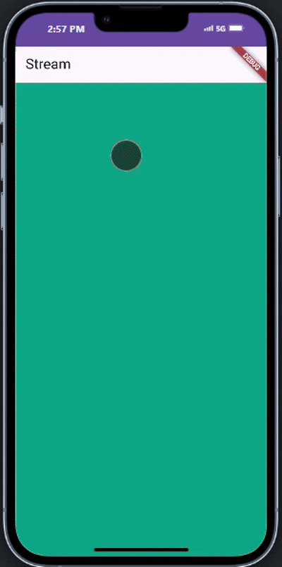
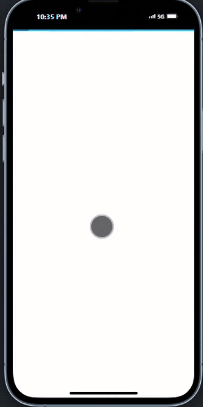
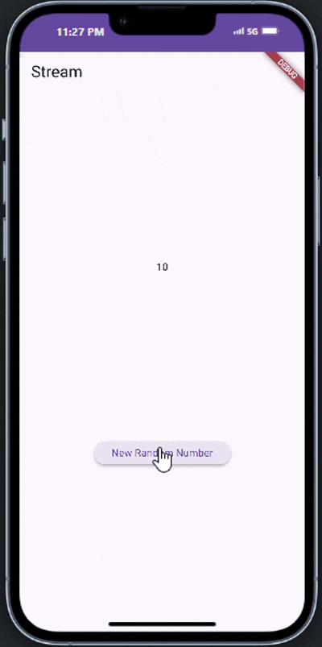
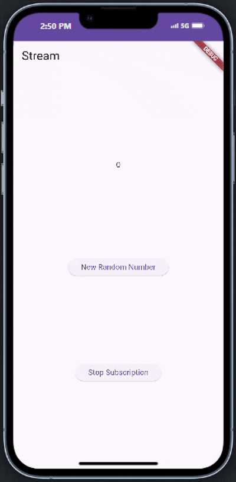
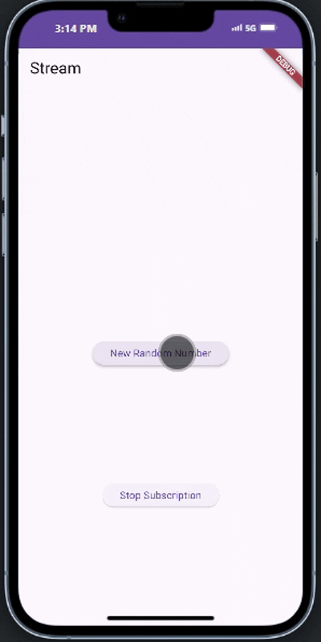

# Tugas Flutter State Management dengan Streams

## Deskripsi Proyek

Proyek Flutter yang mendemonstrasikan state management dengan streams.

## Laporan Praktikum

### Soal no 1

Menambahkan nama panggilan pada title app sebagai identitas hasil pekerjaan dan mengganti warna tema sesuai kesukaan.

```dart
 Widget build(BuildContext context) {
    return MaterialApp(
      title: 'Stream DwiBayu',
      theme: ThemeData(
        Gantilah warna tema aplikasi sesuai kesukaan Anda.
primarySwatch: Colors.lightGreen,
      ),
      home: const StreamHomePage(),
    );
 }
```

### Soal no 2

Menambahkan 5 warna lainnya sesuai keinginan Anda pada variabel colors

```dart
 final List<Color> colors = [
    Colors.blueGrey,
    Colors.amber,
    Colors.deepPurple,
    Colors.lightBlue,
    Colors.teal,
    Colors.pink,
    Colors.red,
    Colors.green,
    Colors.orange,
    Colors.lime,
  ];
```

### Soal No 3

Jelaskan fungsi keyword yield\* pada kode tersebut!

```dart
 yield* Stream.periodic(const Duration(seconds: 1), (int t))
```

#### Penjelasan

yield\* digunakan, ia mengambil seluruh nilai dari stream yang direferensikan dan meneruskannya satu per satu ke stream yang sedang dibuat.

Apa maksud isi perintah kode tersebut?

```dart
 Stream<Color> getColors() async* {
    yield* Stream.periodic(const Duration(seconds: 1), (int t) {
      int index = t % colors.length;
      return colors[index];
    });
  }
```

#### Penjelasan

Kode ini membuat sebuah stream yang:

- Mengeluarkan warna dari array colors secara berurutan
- Berganti warna setiap 1 detik
- Setelah mencapai warna terakhir di array, kembali lagi ke - warna pertama (berputar)

### Soal No 4
 
 #### Demo
 
 

 ### Soal No 5
 
 Jelaskan perbedaan menggunakan listen dan await for (langkah 9) !
 
 Kedua pendekatan yang Anda tunjukkan digunakan untuk mengonsumsi nilai dari stream, tetapi memiliki perbedaan mendasar dalam cara kerja dan penggunaannya:
 
 ```dart
 //langkah 9
 await for (var eventColor in colorStream.getColors()) {
       setState(() {
         bgColor = eventColor;
       });
     }
 
 ```
 ##### Karakteristik:
 
 - Menggunakan sintaks async/await yang membutuhkan fungsi yang diawali dengan async
 - Memblokir eksekusi fungsi saat ini sampai stream selesai (completed)
 - Kode setelah loop await for tidak akan dijalankan sampai stream berakhir
 - Lebih mudah dibaca dan mirip dengan sintaks loop pada umumnya
 - Cocok untuk stream yang pasti berakhir
 
 ```dart
 
 //langkah 13
 colorStream.getColors().listen((eventColor) {
       setState(() {
         bgColor = eventColor;
       });
     });
 ```
 ##### Karakteristik:
 
 - Menggunakan pendekatan callback
 - Non-blocking - eksekusi fungsi terus berlanjut setelah memanggil listen()
 - Callback dijalankan setiap kali ada event baru dari stream
 - Memberikan lebih banyak kontrol (bisa menambahkan handler untuk error, completion, dsb)
 - Cocok untuk stream yang terus berjalan (continuous stream)
 
 ##### Kesimpulan
 - Langkah 9 (await for) tidak ideal untuk stream tak terbatas seperti yang dihasilkan oleh getColors() karena akan memblokir eksekusi fungsi selamanya.
 
 - Langkah 13 (listen) adalah pendekatan yang lebih tepat untuk kasus ini, karena:
 
 Tidak memblokir eksekusi fungsi
 Memungkinkan UI untuk tetap responsif
 Cocok untuk stream yang terus menghasilkan nilai tanpa batas waktu     

 ### Soal No 6

Jelaskan maksud kode langkah 8 dan 10 tersebut!

```dart
//Langkah 8
@override
  void initState() {
    numberStream = NumberStream();
    NumberStreamController = numberStream.controller;
    Stream stream = NumberStreamController.stream;
    stream.listen((event) {
      setState(() {
        lastNumber = event;
      });
    });
    super.initState();
  }
```

#### Penjelasan

1. Inisialisasi NumberStream: Membuat instance dari kelas NumberStream (yang sudah didefinisikan di stream.dart).

2. Akses StreamController: Mengambil referensi controller dari numberStream dan menyimpannya dalam variabel NumberStreamController.

3. Mendapatkan Stream: Mengakses stream dari controller, yang merupakan aliran data yang akan digunakan untuk menerima nilai.

4. Listen Stream: Memasang listener pada stream menggunakan listen(). Setiap kali ada data baru di stream:

- Callback function akan dipanggil dengan nilai baru (event)
- Memanggil setState() untuk memperbarui UI
- Menyimpan nilai baru ke dalam lastNumber

5. Memanggil super.initState(): Menjalankan implementasi initState() dari kelas induk.

```dart
//Langkah 10
void addRandomNumber() {
    Random random = Random();
    int myNum = random.nextInt(10);
    numberStream.addNumberToSink(myNum);
  }
```

#### Penjelasan

1. Membuat Random Object: Membuat instance dari Random untuk menghasilkan angka acak.

2. Menghasilkan Angka Acak: Menggunakan random.nextInt(10) untuk mendapatkan angka acak antara 0-9.

3. Menambahkan ke Stream: Memanggil method addNumberToSink() dari numberStream dengan angka acak yang dihasilkan.

#### Demo



### Soal No 7
 
 Jelaskan maksud kode langkah 13 sampai 15 tersebut!
 
 ```dart
 //langkah 13
 addError(){
     controller.sink.addError("error");
   }
 
 ```
 
 #### Penjelasan
 
 Method ini digunakan untuk menambahkan error ke dalam stream melalui sink.
 
 1. controller.sink.addError():
 
 - Memasukkan sebuah error (dalam hal ini string "error") ke dalam stream.
 - Listener yang mendengarkan stream akan menerima error ini dan dapat menanganinya menggunakan callback onError.
 
 3. Efek: Ketika error ditambahkan ke stream, listener akan memicu callback onError.
 
 ```dart
 //langkah 15
 void addRandomNumber() {
     Random random = Random();
     // int myNum = random.nextInt(10);
     // numberStream.addNumberToSink(myNum);
     numberStream.addError();
   }
 
 ```
 
 #### Penjelasan
 
 Method ini awalnya dirancang untuk menambahkan angka acak ke stream, tetapi saat ini hanya memanggil method addError() dari numberStream.
 
 1. numberStream.addError():
 
 - Memanggil method addError() yang sudah didefinisikan di langkah 13.
 - Menambahkan error ke stream alih-alih angka acak.
 
 2. Efek: Listener pada stream akan menerima error, dan callback onError akan dipanggil.

 ### Soal No 8
 
 Jelaskan maksud kode langkah 1-3 tersebut!
 
 ```dart
 // langkah 1
 late StreamTransformer transformer;
 ```
 
 #### Penjelasan
 
 - Membuat instance baru dari kelas NumberStream
 - Mengambil controller dari instance tersebut dan menyimpannya di variabel numberStreamController
 - Mendapatkan stream dari controller dan menyimpannya di variabel lokal stream
 
 ```dart
 //langkah 2
  transformer = StreamTransformer<int, int>.fromHandlers(
       handleData: (value, sink) {
         sink.add(value * 10);
       },
       handleError: (error, trace, sink) {
         sink.add(-1);
       },
       handleDone: (sink) => sink.close(),
     );
 ```
 
 #### Penjelasan
 
 - Transformer ini mengolah data dari tipe int ke int (ditunjukkan dengan StreamTransformer<int, int>)
 
 - Handler data:
 
   - handleData adalah fungsi yang dijalankan ketika ada data baru di stream
   - Parameter value adalah nilai asli dari stream (angka acak 0-9)
   - Parameter sink adalah tempat memasukkan data hasil transformasi
   - sink.add(value \* 10) mengalikan nilai asli dengan 10 dan mengirimkannya ke downstream
 
 - Handler error:
 
   - handleError dijalankan ketika terjadi error di stream
   - Alih-alih meneruskan error, transformer ini mengirim nilai tetap -1
   - Ini membuat aplikasi tetap berjalan meski ada error
 
 - Handler done:
 
   - handleDone dijalankan ketika stream sumber selesai
   - Fungsinya menutup sink untuk menandakan bahwa transformasi juga selesai
 
 ```dart
 //langkah 3
      stream.transform(transformer).listen((event) {
       setState(() {
         lastNumber = event;
       });
     }).onError((error) {
       setState(() {
         lastNumber = -1;
       });
     });
 
 ```
 
 #### Penjelasan
 
 - Menerapkan transformer yang telah didefinisikan sebelumnya pada stream
 - Mendengarkan (listen) stream yang telah ditransformasi
 - Ketika ada event baru:
   - Memperbarui state dengan nilai event tersebut (yang sudah dikalikan 10 oleh transformer)
   - Menampilkan nilai tersebut ke UI melalui variabel lastNumber
 - Ketika terjadi error:
   - Menangkap error melalui handler onError
   - Mengatur nilai lastNumber menjadi -1
   - Memperbarui UI untuk menampilkan nilai tersebut
 
 #### Demo
 
 

 ### Soal No 9

Jelaskan maksud kode langkah 2, 6 dan 8 tersebut!

```dart
// langkah 2
late StreamSubscription subscription;
```

#### Penjelasan

- StreamSubscription adalah objek yang merepresentasikan langganan (subscription) ke sebuah stream
- Deklarasi ini memungkinkan untuk menyimpan referensi ke subscription yang akan dibuat saat listen stream
- Penanda late menunjukkan bahwa variabel akan diinisialisasi sebelum digunakan, tapi tidak saat dideklarasikan
- Dengan menyimpan subscription, kita bisa melakukan operasi seperti pause, resume, atau cancel pada langganan stream

```dart
// langkah 6
@override

void dispose() {
subscription.cancel();
numberStream.close();
super.dispose();
}
```

#### Penjelasan

- Method dispose() dipanggil saat widget dihapus dari tree
- subscription.cancel() membatalkan langganan ke stream, mencegah memory leak
  numberStream.close() menutup stream dan controller-nya, membebaskan resource
- super.dispose() memanggil method dispose pada kelas induk (State)
- Langkah ini sangat penting untuk menghindari kebocoran memori (memory leak) ketika widget tidak lagi digunakan

```dart
// langkah 8

void addRandomNumber() {
Random random = Random();
int myNum = random.nextInt(10);

    if (!numberStreamController.isClosed) {
      numberStream.addNumberToSink(myNum);
    } else {
      setState(() {
        lastNumber = -1;
      });
    }

}
```

#### Penjelasan

- Method ini menghasilkan angka acak antara 0-9 menggunakan Random().nextInt(10)
- Sebelum menambahkan angka ke stream, dilakukan pengecekan apakah stream masih aktif dengan !numberStreamController.isClosed
- Jika stream masih terbuka, angka acak ditambahkan ke stream menggunakan numberStream.addNumberToSink(myNum)
- Jika stream sudah ditutup, UI diperbarui dengan nilai -1 sebagai indikator bahwa stream tidak lagi aktif
- Pengecekan ini mencegah error "Bad state: Cannot add event after closing" yang terjadi jika mencoba menambahkan data ke stream yang sudah ditutup

#### Demo



### Soal No 10
 
 ```dart
 subscription = stream.listen((event) {
   setState(() {
     values += '$event - ';
   });
 });
 subscription2 = stream.listen((event) {  // Error terjadi di sini
   setState(() {
     values += '$event - ';
   });
 });
 
 ```
 
 **Mengapa Error Ini Terjadi**
 Secara default, stream di Dart adalah "single-subscription", yang artinya:
 
 1. Stream hanya dapat memiliki satu listener pada satu waktu
 2. Setelah stream dilistener (dengan stream.listen()), stream tersebut tidak dapat dilistener lagi
 
 Ketika mencoba menambahkan listener kedua pada subscription2, Dart melempar error karena stream sudah didengarkan oleh subscription.
 
 ### Soal NO 11
 **Jelaskan mengapa hal itu bisa terjadi ?**
 
 Ini terjadi karena menggunakan broadcast stream (melalui asBroadcastStream()) yang memungkinkan banyak listener, dan Saya telah mendaftarkan dua subcription listener yang melakukan hal yang sama: menambahkan angka ke variabel values.
 
 1. Saat tombol "New Random Number" ditekan, fungsi addRandomNumber() dipanggil
 2. Fungsi ini menghasilkan angka acak dan menambahkannya ke stream melalui numberStream.addNumberToSink(myNum)
 3. Ketika angka baru ditambahkan ke stream, semua listener akan dipanggil
 4. Dalam hal ini, Anda memiliki dua listener:
 - subscription menambahkan angka ke variabel values
 - subscription2 juga menambahkan angka yang sama ke variabel values
 5. Hasilnya, untuk satu angka acak yang dihasilkan, teks nilai ditambahkan dua kali
 
 #### Demo
 
 